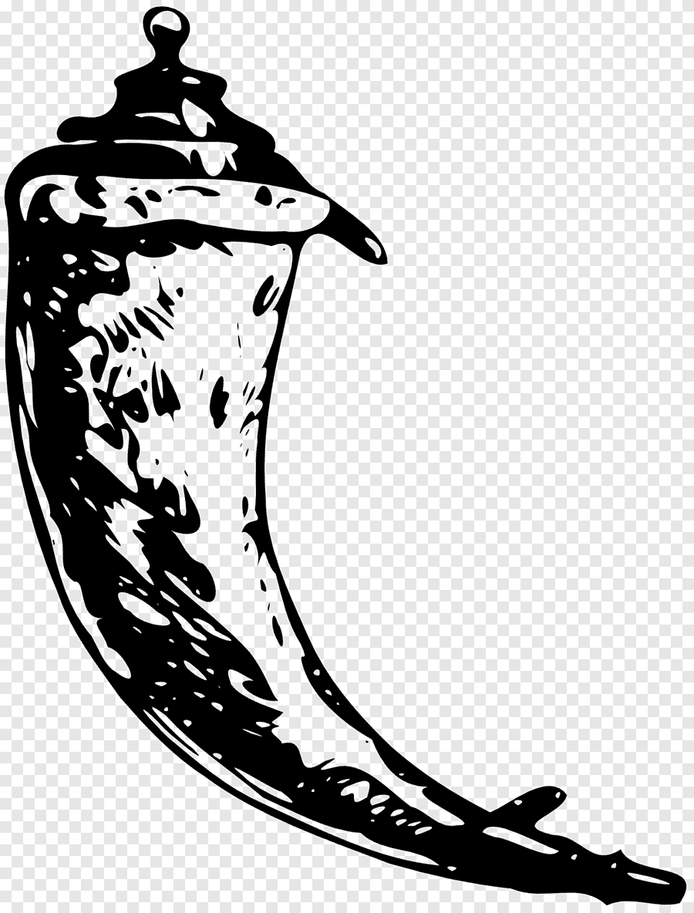
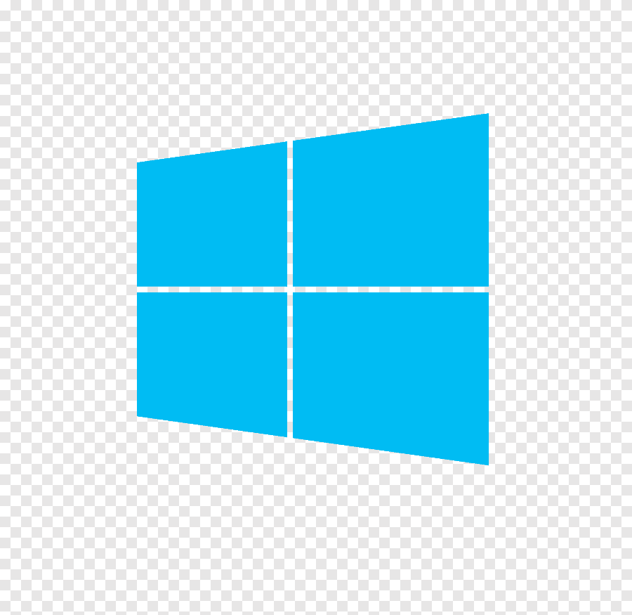

 

<!-- <h1 align="center">
  
</h1> -->
<h1>About Me:</h1>

  Hi, I'm Angelo Indre, Recent graduate with Bachelors in Computer Science & Software Developer from Akron, OH.
   
   
  🧑‍💼 I'm currently interning at <a href="https://www.blazebite.com">Blazebite</a>
   
  💻 I love Writing code, learning, playing music with my band. 💻🎹🤓
   
  📚 I’m currently learning PowerBI
   
  📫 How to reach me 👇

    

<h2 align="center">🔥 Languages & Frameworks & Tools & Abilities 🔥</h2> 

  </code>
  
  
  
  
  
  
  
  
  
  
  
  
  
  

<h2 align="center">⚡ Stats ⚡</h2>
 

  

  

